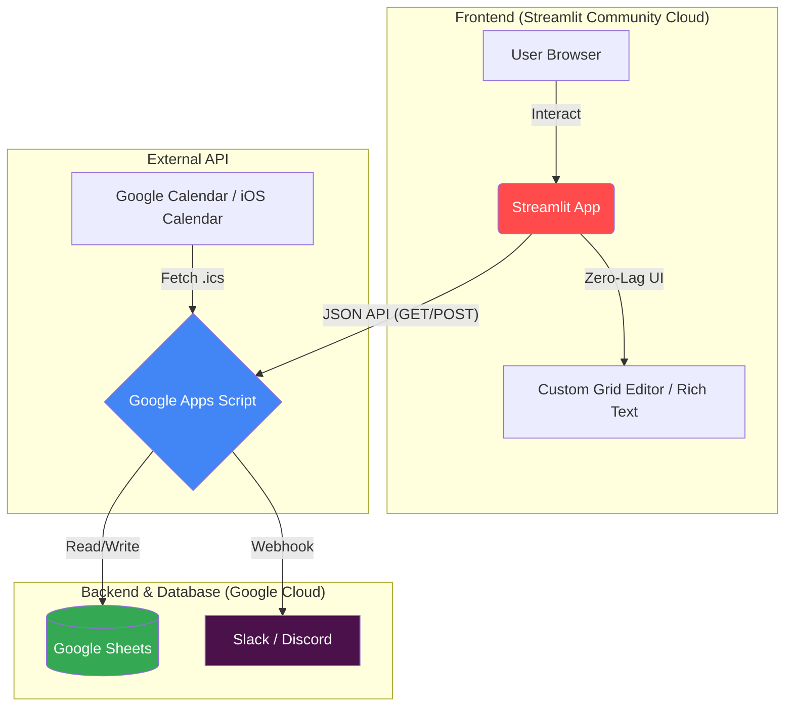

# 📅 日程調整 Pro (Schedule Adjust Pro)

Streamlit × Google Apps Script (GAS) で構築された、プロジェクト・団体向けの高機能日程調整ツールです。  
独自のカスタムコンポーネント（Custom HTML/JS）を採用することで、Streamlit特有の再読み込みラグを排除し、スマートフォンからも爆速で快適な入力UIを実現しています。

## 🚀 主な特徴

- **3つの柔軟な調整モード**:
  - `🕒 時間帯モード`: 15分刻みで詳細な空き時間を直感的にペイント入力（スマホのタッチ操作対応）。
  - `🏫 時間割モード`: 大学の1限〜5限・放課後の枠を使って、全メンバーの空きコマを一括集計。
  - `📅 候補リストモード`: 任意のイベント案（会議、飲み会など）に対する出欠アンケート。
- **究極の時短入力 (Smart Input)**:
  - **時間割パワー反映**: 自分の時間割を一度登録しておけば、ワンクリックで「授業等（不可）」として一括反映。
  - **iCal連携**: GoogleカレンダーやiOSカレンダーの非公開URL（.ics）を読み込み、個人の予定を自動でグレーアウト。
- **管理者向け・高度な集計機能**:
  - 役職、プロジェクト、委員会ごとの強力なクロスフィルター集計。
  - 「未定(△)」を0.5人としてカウントする柔軟なヒートマップ表示。
  - 未回答者をワンクリックで抽出し、リスト化。
  - Slack連携（Webhook）による、新規イベント作成時の自動通知＆メンション機能。
  - 回答者の名前を隠す「プライベート調整」機能。

## 📦 システム構成図 (Architecture)

当アプリは、ホスティングコストを完全にゼロに抑えつつ、非エンジニアでもデータベース（スプレッドシート）を管理しやすいサーバーレスアーキテクチャを採用しています。

**Why this architecture?**
- **Zero Hosting Cost**: Streamlit Community Cloud と Google Cloud の無料枠を利用し、維持費0円で完全稼働。
- **Database Visibility**: スプレッドシートをDBとして使用するため、管理者が直接データを閲覧・修正可能。
- **High Extensibility**: GASをハブにすることで、外部カレンダー取得やチャット通知をセキュアかつ簡単に実装。

## 🛠️ 技術スタック

- **Frontend**: Python 3, Streamlit, Pandas, Plotly, HTML/CSS/Vanilla JS (Custom Components for Grid UI)
- **Backend / API**: Google Apps Script (GAS)
- **Database**: Google Sheets
- **Integration**: Slack Webhook, iCalendar (.ics) parsing

---

## ⚙️ セットアップ手順 (Getting Started)

ご自身の環境でこのアプリを動かすための初期設定手順です。

### 1. Google スプレッドシートの準備
新規スプレッドシートを作成し、以下の5つのシート名（タブ）を作成します。  
**⚠️ 重要**: 各シートの1行目（A列から順）に、以下の通りのヘッダー名を入力してください。

1. **`users`** シート（ユーザー情報）
   - `user_id`, `name`, `pin`, `role`, `group_1`, `group_2`, `group_3`, `group_4`, `secret_word`, `calendar_url`, `slack_id`
2. **`events`** シート（作成されたイベント情報）
   - `event_id`, `title`, `start_date`, `end_date`, `status`, `start_idx`, `end_idx`, `description`, `event_type`, `event_options`, `deadline`, `auto_close`, `target_scope`, `is_private`
3. **`responses`** シート（回答データ）
   - `event_id`, `user_id`, `date`, `binary_data`, `comment`
4. **`fixed_schedule`** シート（個人の時間割データ）
   - `user_id`, `day_of_week`, `binary_data`
5. **`archive`** シート（終了したイベントの退避先）
   - `responses` シートと全く同じヘッダーを設定してください。

### 2. Google Apps Script (GAS) のデプロイ
1. スプレッドシートのメニューから `拡張機能` > `Apps Script` を開きます。
2. 付属の `code.gs`（または `GAS` コード）をエディタに貼り付けます。
3. コード冒頭の以下の定数をご自身の環境に合わせて変更します。
   - `SPREADSHEET_ID`: 1で作成したスプレッドシートのURLに含まれるID部分
   - `ADMIN_WEBHOOK_URL`: 通知を送りたいSlackのWebhook URL（不要な場合はそのままか空文字）
4. 右上の `デプロイ` > `新しいデプロイ` をクリックし、以下を設定します。
   - 種類の選択: **ウェブアプリ**
   - 実行するユーザー: **自分**
   - アクセスできるユーザー: **全員**
5. デプロイ後に表示される **ウェブアプリのURL** をコピーします。

### 3. Streamlit アプリの設定と公開
1. このリポジトリをご自身のGitHubにフォーク（またはプッシュ）します。
2. `app.py` 内の冒頭にある以下の変数を書き換えます。
   - `GAS_URL`: 手順2でコピーしたGASのウェブアプリURL
   - `APP_BASE_URL`: これから公開するStreamlitのURL（共有リンク生成に使用されます）
3. [Streamlit Community Cloud](https://streamlit.io/cloud) にログインし、「New app」から該当リポジトリを選択してデプロイします。

---
*Created and maintained by [Tomoki Ueno / SSSRC]*
